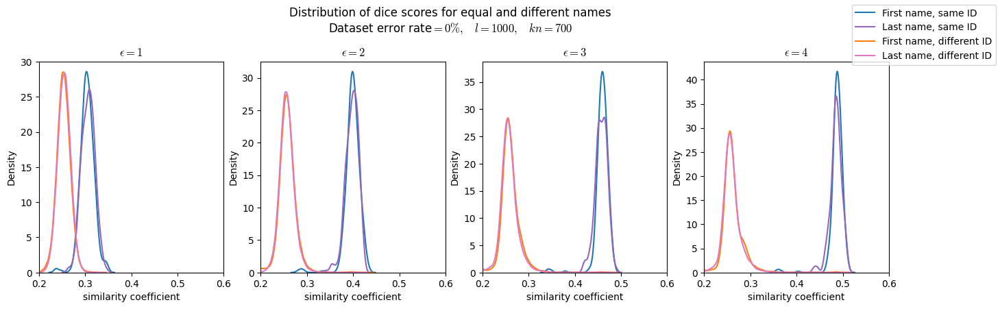
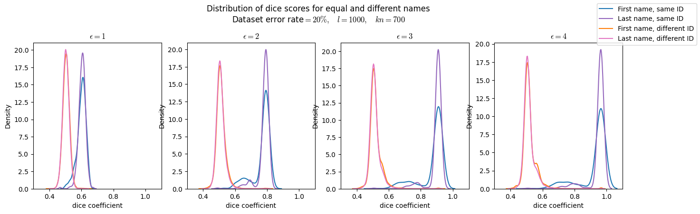
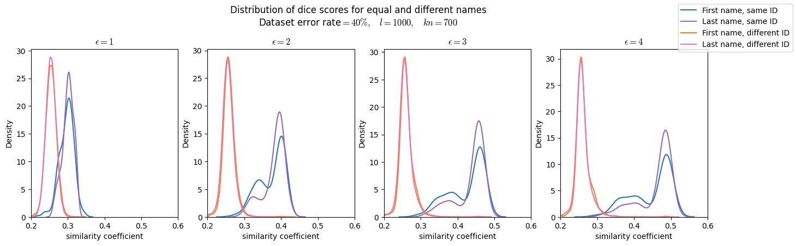
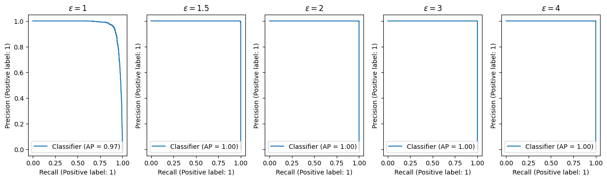

# Curesdev tokenization and linkage protocol

Here we present a tokenization and linkage protocol for anonymizing and linking patient records. The protocol is based on Bloom filters and differential privacy, and it is resilient to typos and misspellings.

## Tokenization using field-based Bloom filters

Tokens are generated on a field-by-field basis. For each field, we generate a Bloom filter that encodes the information in the field. The Bloom filter is a bit array of length $l=1024$.

One token is generated for each separate field, as a way to enable the linkage of records with different fields available, and as a way to ease the privacy guarantee analysis of the method.

### Misspelling-tolerant free text tokenization

Free text fields such as first names, last names or addresses are prone to misspellings and typos. To prevent this from affecting the linkage, we expand each string into bigrams (all its substrings of length 2) and insert each one into the Bloom filter.

Using this approach, names can successfully be linked even when having typos or alternate spellings.

We tested this method with synthetic data with 0%, 20% and 40% error rates for first and last names, and compared the similarity distribution between tokens from the same name and tokens from different names. The results are shown in the following figure:

### Balanced Bloom filters

Bloom filters have multiple applications. Oftentimes, they are used to index an unknown amount of values for later retrieval. In our case, the number of values we will insert is known beforehand (just one value for some fields, and a few values for others --e.g. bigrams). To make optimal use of the Bloom Filter, that is, to encode as much information as possible, we want the number of 0s and 1s in the Bloom filter to be even.

We achieve this balance by choosing a dynamic number of hash functions. Given a Bloom filter of length $l$, and taking into account that hashes are random and thus result in overlaps, we need to insert $l\cdot\ln(2)$ values to get a balanced Bloom filter. If there are $n$ values to insert, we need to set $k$ hash functions such that: $k = \frac{l\cdot\ln(2)}{n}$.

Using this approach, not only do we make optimal use of the Bloom filter, but also prevent biases that would appear when comparing Bloom filters with different numbers of inserted values, e.g. when comparing a very long name with a short one.

## Differential privacy

We use differential privacy to prevent dictionary attacks on the tokenized values. Differential privacy is a mathematical framework that provides a formal guarantee of privacy for the individuals in the dataset. It is based on the idea that the tokens generated from PII are not deterministic, but a random amount of noise is added to them.

This noise is controlled by a parameter called epsilon ($\epsilon$).
Each bit of the Bloom filter is flipped with probability:

$$P_\text{flip}=\frac{1}{1 + e^\epsilon}$$

### Preventing dictionary attacks for low cardinality fields

Fields with low cardinalities, such as sex (male or female), country (about 200 countries in the world), or date of birth (about 36,500 days in the last century) are vulnerable to dictionary attacks.
If the Bloom filter is kept unchanged, or only a small amount of noise is added, an attacker can easily compute the Bloom filter for each possible value to find a match.

For these fields, adding extra noise can prevent this kind of attack at the expense of lower accuracy guarantees in the linking phase.

We analyzed the accuracy an attacker would get in their attempted reversal of the tokenization process, for different probabilities of flipping a bit in the Bloom filter. The results are shown in the figure below.

The figure shows that when flipping 42% or less of the bits, the real value is recoverable in almost 100% of the cases. However, the probability of identifying the tokenized value decreases and gets completely random at 50% of flipped bits, as expected.

Therefore, we recommend a flipping probability of about 46% (epsilon = 0.2) which makes linkage feasible but prevents dictionary attacks from having certainty about the real value.

We repeated the same analysis for higher cardinality fields:

By targeting a 95% accuracy for the linkage, we settled on the following epsilon values for the differential privacy:

| Field                  | Epsilon     |
| ---------------------- | ----------- |
| sex_at_birth           | epsilon=0.2 |
| zip_code_at_birth      | epsilon=0.3 |
| abbr_zip_code_at_birth | epsilon=0.4 |
| state_at_birth         | epsilon=0.2 |
| country_at_birth       | epsilon=0.2 |

## Linkage

### Bloom filter similarity

There are several ways to compare two Bloom filters. The most popular is the Dice coefficient, which is defined as the number of 1s in the intersection of the two Bloom filters divided by the number of 1s in the union of the two Bloom filters. This metric has the feature of ignoring the positions where both Bloom filters being compared have a 0. This feature is very useful for sparse Bloom filters, but not so much for our balanced Bloom filters.

We chose to use a similarity score that compares all bits in the Bloom filter. The similarity is thus defined by:

$$S = \frac{1}{l}\sum_{i=1}^l \delta_{b_i^1,b_i^2}$$

where $l$ is the length of the Bloom filter, $b_i^1$ is the $i$-th bit of the first Bloom filter, $b_i^2$ is the $i$-th bit of the second Bloom filter, and $\delta_{b_i^1,b_i^2}$ is the Kronecker delta function, which is 1 if $b_i^1=b_i^2$ and 0 otherwise.

### Linkage protocol

The first step in our linkage protocol is an assessment of the similarity between each pair of fields.

The token similarity is converted to 4 categories: no match, maybe a match, likely a match, and exact match. The thresholds for each category are defined in the following table:

| Category       | Similarity range |
| -------------- | ---------------- |
| no match       | (0, 0.7)         |
| maybe a match  | (0.7, 0.76)      |
| likely a match | (0.76, 0.83)     |
| exact match    | (0.83, 1)        |

After classifying all the fields that are present in both records, we consider a match those that have 80% of their fields with a likely or exact match. The remaining records are considered non-matches, but manual analysis is recommended for those that have a high number of fields with a "maybe a match" classification.

Using this approach, we can achieve a very high precision and recall, as shown in the following figure:

# Conclusion

In the present work, we have presented a tokenization and linkage protocol that both guarantees the privacy of the individuals in the dataset and allows for a high accuracy in the linkage.
The methodology is resilient to typos and misspellings, and it is robust to uneven availability of data by doing a field-by-field tokenization.

Several linkage protocols have been explored yielding very high precision and recall values, but validation with real data would be needed to define the best protocol for each use case.
