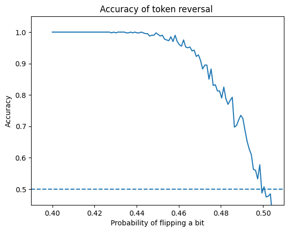

# CuresDev Personal Identifiable Information (PII) Tokenizer Specification

In this document we describe the specification of the CureDev PII tokenizer version 1.0.

# Input fields

The tokenizer takes as input a set of fields with personal information about the patient and their parents:

1. first_name (required)
2. last_name (required)
3. full_name
4. middle_name
5. date_of_birth (required)
6. former_name
7. sex_at_birth (required)
8. disease_omim_id
9. gene_name
10. city_at_birth
11. address_at_bith
12. zip_code_at_birth
13. abbr_zip_code_at_birth
14. state_at_birth
15. country_at_birth
16. parent1_first_name
17. parent1_last_name
18. parent1_email
19. parent2_first_name
20. parent2_last_name
21. parent2_email
22. metadata

# Tokenization pipeline

For each input field, we generate a token that represents the value of that field.
This token is generated by a pipeline of three steps:

1. Normalization: we apply a normalization process to the input value. This process is different for each field.
2. Expansion: some fields are expanded or transformed in order to capture the similarity between different values.
3. Tokenization: we generate a token by inserting the expanded value into a Bloom filter.
4. Anonymization: we add noise following the differential privacy mechanism.


| token                        | input field                            | normalization            | expansion | differential privacy |
| ---------------------------- | -------------------------------------- | ------------------------ | --------- | -------------------- |
| first_name_token             | first_name                             | keep_letters             | bigrams   | epsilon=0.3          |
| first_name_soundex_token     | first_name                             | keep_letters             | soundex   | epsilon=0.3          |
| last_name_token              | last_name                              | keep_letters             | bigrams   | epsilon=0.3          |
| last_name_soundex_token      | last_name                              | keep_letters             | soundex   | epsilon=0.3          |
| middle_name_token            | middle_name                            | keep_letters             | bigrams   | epsilon=0.3          |
| full_name_token              | first_name + middle_name + last_name   | keep_letters             | bigrams   | epsilon=0.3          |
| date_of_birth_token          | date_of_birth                          | ISO 8601 date            |           | epsilon=0.4          |
| former_name_token            | former_name                            | keep_letters             | bigrams   | epsilon=0.3          |
| sex_at_birth_token           | sex_at_birth                           | "M" or "F"               |           | epsilon=0.2          |
| disease_omim_id_token        | disease_omim_id                        | OMIM disease ID          |           | epsilon=0.3          |
| gene_name_token              | gene_name                              | HGNC gene                |           | epsilon=0.3          |
| city_at_birth_token          | city_at_birth                          | keep_letters             | bigrams   | epsilon=0.3          |
| address_at_bith_token        | address_at_bith                        | keep_letters_and_numbers | bigrams   | epsilon=0.3          |
| zip_code_at_birth_token      | zip_code_at_birth                      | keep_letters_and_numbers |           | epsilon=0.4          |
| abbr_zip_code_at_birth_token | abbr_zip_code_at_birth                 | keep_letters_and_numbers |           | epsilon=0.3          |
| state_at_birth_token         | state_at_birth                         | keep_letters             |           | epsilon=0.2          |
| country_at_birth_token       | country_at_birth                       | 2 or 3 letter ISO code   |           | epsilon=0.2          |
| parent1_first_name_token     | parent1_first_name                     | keep_letters             | bigrams   | epsilon=0.3          |
| parent1_last_name_token      | parent1_last_name                      | keep_letters             | bigrams   | epsilon=0.3          |
| parent1_full_name_token      | parent1_first_name + parent1_last_name | keep_letters             | bigrams   | epsilon=0.3          |
| parent1_email_token          | parent1_email                          | email (RFC 3696)         |           | epsilon=0.3          |
| parent2_first_name_token     | parent2_first_name                     | keep_letters             | bigrams   | epsilon=0.3          |
| parent2_last_name_token      | parent2_last_name                      | keep_letters             | bigrams   | epsilon=0.3          |
| parent2_full_name_token      | parent2_first_name + parent2_last_name | keep_letters             | bigrams   | epsilon=0.3          |
| parent2_email_token          | parent2_email                          | email (RFC 3696)         |           | epsilon=0.3          |
| metadata                     | metadata                               |                          |           |                      |


# Normalization

We perform a normalization process in order to prevent the same string from being represented in very different ways.

For fields that have a specific format, such as `date_of_birth`, we perform a format validation and normalization.
The same is applied to `parent1_email` and `parent2_email` fields, which are validated against the [RFC 3696](https://tools.ietf.org/html/rfc3696) specification.
`sex_at_birth` is validated against the values "M" and "F".

All free-form strings are normalized with the following preprocessing steps:

1. Convert all letters to lowercase
2. Replace all accented characters with their unaccented version.
3. Remove whitespace at the beggining and the end of the string.
4. Join all contiguous whitespace inside the string into a single space character.

After these steps, we have two types of normalization:

* **keep_letters_and_numbers**: in which we remove all characters that are not letters or numbers.
* **keep_letters**: in which we remove all characters that are not letters.

# Expansion

For fields that consist of a free-form string, we perform an expansion process that generates a set of bigrams from the string.
This expansions allows the token to capture the similarity between strings that are not exactly the same.
The details of the expansion process are described in [Appendix A](#appendix-a-methods).

In addition to bigrams, the `first_name` and `last_name` fields are also transformed by the [Soundex](https://en.wikipedia.org/wiki/Soundex) algorithm.

# Tokenization

Each token is generated by inserting the expanded strings into a Bloom filter of **1024 bits** with a dynamic number of hash functions.
We choose the number of hash functions dynamically, based on the number of bigrams that are inserted into the filter.
The goal is to insert ln(2)*1024 ones, which results in a Bloom filter with approximately half of the bits set to 1.

# Differential privacy

Each Bloom filter is perturbed with a differential privacy mechanism that adds noise to the token.
Depending on the field, we introduce different amounts of noise.
For fields with lower cardinality, we add more noise in order to prevent a dictionary attack with which the tokenized value can be identified.
In [Appendix A](#appendix-a-methods) we describe the estimations we made for the cardinality of each field.

# Appendix A: methods

## Bigrams expansion

The bigrams of a string are generated by taking all the pairs of consecutive characters in the string.

```
bigrams("abc") = ["ab", "bc"]
```

In the edge case of strings of zero or one character, we keep that string as the only bigram:

```
bigrams("") = [""]
bigrams("a") = ["a"]
```

In our implementation of the bigrams method, we also add a suffix for each bigram which indicates how many times that bigram appears in the string. For example:

```
bigrams("barbara) = ["ba:1", "ar:1", "rb:1", "ba:2", "ar:2", "ra:1"]
```

# Appendix B: privacy guarantees

## Differential privacy

We use differential privacy to prevent dictionary attacks on the tokenized values.
Differential privacy is a mathematical framework that provides a formal guarantee of privacy for the individuals in the dataset.
It is based on the idea that the tokens generated from PII are not deterministic, but a random amount of noise is added to them.

This noise is controlled by a parameter called privacy budget ($\epsilon$).
Each bit of the Bloom filter is flipped with probability:

$$P_\text{flip}=\frac{1}{1 + e^\epsilon}$$

## Preventing dictionary attacks for low cardinality fields

Fields with low cardinalities, such as sex (male or female), country (about 200 countries in the world), or date of birth (about 36,500 days in the last century) are vulnerable to dictionary attacks.
If the Bloom filter is kept unchanged, or only a small amount of noise is added, an attacker can easily compute the Bloom filter for each possible value to find a match.

For these fields, adding extra noise can prevent this kind of attack at the expense of lower accuracy guarantees in the linking phase.

We analyzed the accuracy an attacker would get in their attempted reversal of the tokenization process, for different probabilities of flipping a bit in the Bloom filter. The results are shown in the figure below.



The figure shows that when flipping 42% or less of the bits, the real value is recoverable in almost 100% of the cases. However, the probability of identifying the tokenized value decreases and gets completely random at 50% of flipped bits, as expected.

Therefore, we recommend a flipping probability of about 46% (epsilon = 0.2) which makes linkage feasible but prevents dictionary attacks from having certainty about the real value.

We repeated the same analysis for higher cardinality fields.

By targeting a 95% accuracy for the linkage, we settled on the following epsilon values for the differential privacy:

| Field                | Cardinality | Epsilon |
| -------------------- | ----------- |---------|
| Sex                  | 2           | 0.2     |
| Date                 | 36500       | 0.4     |
| Abbreviated zip code | ??          | 0.3     |
| Zip code             | ??          | 0.4     |
| Country              | 200         | 0.2     |
| State                | 20          | 0.2     |
| Gene name            | 20,000      | 0.3     |
| Disease OMIM ID      | 20,000      | 0.3     |
